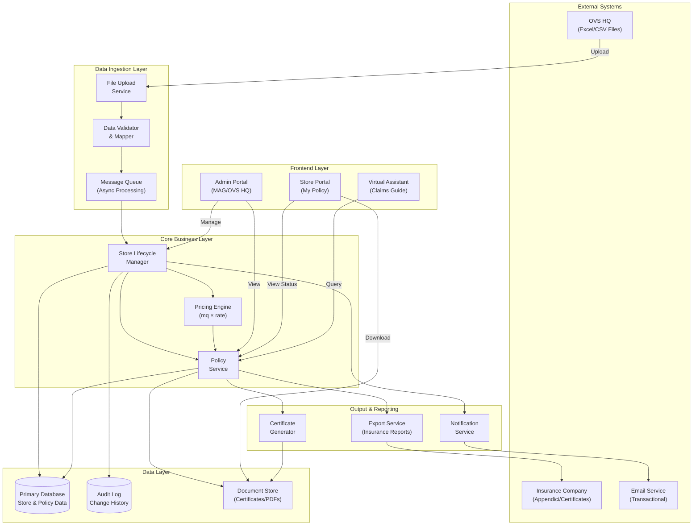

# OVS-CatNat Architecture Document

> **Source of Truth** — All development must align with this document.
> **Last Updated:** 2025-11-25
> **Version:** 1.0.0

---

## 1. Project Overview

**OVS-CatNat** is an insurance management platform designed to handle the CatNat (Catastrophe Naturale) and Property policies for the entire OVS retail network (approximately 1,000–1,500 stores).

### Core Objectives

- **Centralized Policy Management**: Enable MAG (broker) and OVS HQ to manage insurance coverage across all retail locations from a single platform
- **Store-Level Self-Service**: Allow individual store managers to verify coverage status, download certificates, and access claims procedures
- **Dynamic Network Handling**: Automatically manage store lifecycle events (openings, closures, relocations) with minimal manual intervention
- **Automated Premium Calculation**: Apply standardized pricing algorithms based on store square footage (mq × rate = premium)

### Business Context

The platform replaces a manual, file-based process deemed insufficient for managing the high turnover and variability of the OVS retail network. The system must be operational by December 2025/January 2026.

---

## 2. Design Principles

| # | Principle | Rationale |
|---|-----------|-----------|
| 1 | **Modularity over Monolith** | Each domain (ingestion, pricing, user portal, reporting) must be a separate, deployable module to allow independent scaling and maintenance |
| 2 | **Async by Default for Ingestion** | File imports (Excel/CSV) can be large and require validation; processing must be asynchronous to prevent blocking operations |
| 3 | **Observability is Not Optional** | Every transaction, calculation, and state change must be logged for audit trail compliance between OVS, MAG, and insurance companies |
| 4 | **Data Integrity First** | Store lifecycle events (activation/deactivation) must maintain referential integrity; no coverage gaps or ghost policies |
| 5 | **Progressive Enhancement for UX** | Core functionality (status check, certificate download) must work without JavaScript; enhanced features (virtual assistant) are additive |

---

## 3. System Architecture Diagram



### Flow Description

1. **Ingestion Flow**: OVS HQ uploads periodic Excel/CSV files → Validated → Queued for async processing
2. **Core Processing**: Store lifecycle changes trigger pricing recalculations and policy updates
3. **User Access**: Store managers authenticate and view their personalized policy dashboard
4. **Output Flow**: System generates reports for insurance company and stores

---

## 4. Tech Stack Strategy

| Layer | Component | Technology | Status | Notes |
|-------|-----------|------------|--------|-------|
| **Frontend** | Admin Portal | SolidJS + SolidStart | Accepted | Fine-grained reactivity, excellent performance |
| | Store Portal | SolidJS + SolidStart | Accepted | SSR support for progressive enhancement |
| | Virtual Assistant | `[To Be Determined]` | Pending | LLM-based conversational UI for claims guidance |
| | UI Components | `[To Be Determined]` | Pending | Kobalte/Solid-UI/Custom candidates |
| | State Management | Solid Signals/Stores | Accepted | Built-in reactivity primitives |
| **API** | REST API | SolidStart API Routes | Implemented | Full-stack with Vinxi server |
| | Authentication | JWT + Solid Stores | Implemented | Per-store credentials, role-based |
| **Core Services** | Pricing Engine | TypeScript Module | Implemented | Configurable rate tables, mq × rate algorithm |
| | Lifecycle Manager | TypeScript Module | Implemented | State machine for store status transitions |
| | File Processor | TypeScript Module | Implemented | CSV parsing with validation and mapping |
| | Policy Service | TypeScript Module | Implemented | CRUD, renewal, pricing integration |
| **Messaging** | Queue System | In-memory (dev) | Implemented | Production: RabbitMQ/Redis/SQS candidates |
| **Data** | Primary Database | In-memory (dev) | Implemented | Production: PostgreSQL recommended |
| | Audit Storage | In-memory (dev) | Implemented | Append-only log structure |
| | Document Storage | `[To Be Determined]` | Pending | S3-compatible object storage |
| **Output** | Certificate Generator | TypeScript + HTML | Implemented | HTML templates, PDF conversion pending |
| | Notification Service | TypeScript | Implemented | Email templates, provider integration pending |
| | Export Service | TypeScript | Implemented | CSV/JSON exports for insurance company |
| **Infrastructure** | Container Orchestration | `[To Be Determined]` | Pending | Docker + Kubernetes/ECS |
| | CI/CD | `[To Be Determined]` | Pending | GitHub Actions/GitLab CI |
| | Monitoring | `[To Be Determined]` | Pending | Prometheus + Grafana / Datadog |
| **External** | Email Service | `[To Be Determined]` | Pending | SendGrid/SES for transactional |
| | PDF Generation | `[To Be Determined]` | Pending | Puppeteer/pdfmake for certificates |

---

## 5. Data Flow & Interfaces

### 5.1 Interface Contracts

| Interface | Protocol | Format | Direction | Description |
|-----------|----------|--------|-----------|-------------|
| OVS HQ → System | File Upload (HTTPS) | Excel/CSV | Inbound | Periodic store roster updates |
| System → Insurance Co. | API/Export | JSON/CSV | Outbound | Premium adjustments, policy appendices |
| System → Store Portal | REST API | JSON | Bidirectional | Policy status, document requests |
| System → Email Service | API | JSON | Outbound | Transactional notifications |

### 5.2 Data Model (Conceptual)

```
┌─────────────────┐       ┌─────────────────┐       ┌─────────────────┐
│     Store       │       │     Policy      │       │   Certificate   │
├─────────────────┤       ├─────────────────┤       ├─────────────────┤
│ store_code (PK) │──────<│ policy_id (PK)  │──────<│ cert_id (PK)    │
│ business_name   │       │ store_code (FK) │       │ policy_id (FK)  │
│ address         │       │ coverage_type   │       │ issue_date      │
│ square_meters   │       │ insured_sum     │       │ document_url    │
│ status          │       │ premium         │       │ valid_from      │
│ activation_date │       │ effective_from  │       │ valid_to        │
│ closure_date    │       │ effective_to    │       └─────────────────┘
└─────────────────┘       │ status          │
                          └─────────────────┘
```

### 5.3 Communication Patterns

| Pattern | Use Case | Implementation |
|---------|----------|----------------|
| **Request/Response** | User portal queries, admin operations | Synchronous REST API |
| **Event-Driven** | File processing, lifecycle state changes | Async message queue |
| **Pub/Sub** | Notifications (email triggers) | Event bus with subscribers |
| **Batch** | Insurance company exports, audit reports | Scheduled jobs |

### 5.4 Security Boundaries

- **Public Zone**: Store Portal (authenticated per-store)
- **Internal Zone**: Admin Portal (authenticated MAG/OVS users with RBAC)
- **Restricted Zone**: Core services, database (internal network only)

### 5.5 Security Implementation (Current)

| Component | Security Measure | Description |
|-----------|------------------|-------------|
| **Authentication** | Signed JWT Tokens | Tokens include HMAC signature to prevent tampering; role embedded in payload |
| | Password Hashing | Credentials verified against hashed values (demo uses simple hash; production requires bcrypt/Argon2) |
| | Session Validation | Every authenticated request verifies token signature and expiration |
| **Authorization** | Role-Based Access Control | Import operations restricted to `admin` and `broker` roles only |
| | Operation-Level Checks | Each sensitive operation validates user role before execution |
| **Session Isolation** | Data Cleanup on Logout | All service data (policies, imports, audit logs) cleared on logout |
| | Session ID Tracking | Services track session ID and clear data on session change |
| **Memory Management** | Job Pruning | Import jobs automatically pruned after 24 hours |
| | Content Sanitization | File content removed from jobs after processing (5s delay) |
| | Job Limits | Maximum 100 jobs per session to prevent memory exhaustion |
| **Data Exposure Prevention** | Content Stripping | `getAllJobs()` never exposes file content to consumers |

> **Note**: Current implementation is demo/prototype. Production deployment requires:
> - Server-side authentication with proper JWT library (jose, jsonwebtoken)
> - Secure password storage (bcrypt/Argon2)
> - Database-backed sessions with proper isolation
> - HTTPS enforcement and CSRF protection

---

## 6. ADR (Architectural Decision Records) Log

> Record all significant architectural decisions below. Each ADR should be immutable once recorded.

### Template

```markdown
### ADR-XXX: [Decision Title]

**Date:** YYYY-MM-DD
**Status:** [Proposed | Accepted | Deprecated | Superseded by ADR-XXX]
**Deciders:** [Names/Roles]

#### Context
[What is the issue that we're seeing that is motivating this decision?]

#### Decision
[What is the change that we're proposing and/or doing?]

#### Consequences
[What becomes easier or more difficult to do because of this change?]
```

---

### ADR-001: Adopt Modular Architecture Pattern

**Date:** 2025-11-25
**Status:** Accepted
**Deciders:** Architecture Team

#### Context
The OVS-CatNat system must manage multiple concerns (data ingestion, pricing, user portals, reporting) with a tight delivery timeline. A monolithic approach would create deployment bottlenecks and make it difficult to parallelize development across teams.

#### Decision
Adopt a modular architecture where each domain (Ingestion, Core Business, Frontend, Output) is developed and deployed as independent modules with well-defined interfaces.

#### Consequences
- **Easier**: Independent scaling, parallel team development, isolated failure domains
- **Harder**: Requires clear API contracts upfront, adds operational complexity

---

### ADR-002: Async Processing for File Ingestion

**Date:** 2025-11-25
**Status:** Accepted
**Deciders:** Architecture Team

#### Context
OVS will upload Excel/CSV files containing up to 1,500 store records. File validation, parsing, and processing can take significant time. Synchronous processing would block the admin UI and risk timeouts.

#### Decision
Implement asynchronous file processing using a message queue. Upload returns immediately with a job ID; processing status is queryable; results are delivered via notification.

#### Consequences
- **Easier**: Better UX, no timeout issues, retry capability for failed jobs
- **Harder**: Requires queue infrastructure, more complex status tracking

---

### ADR-003: SolidJS as Frontend Framework

**Date:** 2025-11-25
**Status:** Accepted
**Deciders:** Architecture Team

#### Context
The OVS-CatNat platform requires a modern frontend framework that can deliver high performance for the store portal (potentially 1,500 concurrent users), support server-side rendering for progressive enhancement, and provide an excellent developer experience with a tight delivery timeline.

#### Decision
Adopt SolidJS with SolidStart as the frontend framework for both the Admin Portal and Store Portal. Key factors:
- **Fine-grained reactivity**: No Virtual DOM overhead, direct DOM updates for better performance
- **SolidStart**: Full-stack meta-framework with SSR, SSG, and API routes support
- **Familiar syntax**: JSX-based, easy onboarding for developers with React experience
- **Small bundle size**: Critical for store portal performance on varying network conditions
- **Built-in primitives**: Signals and Stores eliminate need for external state management

#### Consequences
- **Easier**: Superior runtime performance, smaller bundles, simpler state management, SSR out of the box
- **Harder**: Smaller ecosystem than React, fewer ready-made component libraries, team may need initial ramp-up

---

### ADR-004: Security Hardening for Demo Implementation

**Date:** 2025-11-25
**Status:** Accepted
**Deciders:** Architecture Team

#### Context
The initial demo implementation had several security vulnerabilities:
1. Authentication tokens were predictable and unsigned, allowing role escalation via localStorage manipulation
2. Import validation marked jobs as "completed" even when mapping errors occurred, giving false success signals
3. Pricing engine failed silently for dates before config start, and bulk operations swallowed errors
4. Import queue had no authorization checks, allowing any user to trigger data mutations
5. In-memory data persisted across logouts, risking cross-session data leakage

#### Decision
Implement comprehensive security hardening while maintaining demo simplicity:
- **Token Signing**: Implement HMAC-based token signatures with role embedded in payload
- **Validation Fix**: Import status now considers both mapping errors AND validation errors
- **Pricing Robustness**: Default configs now start from 2024-01-01; bulk operations return errors explicitly
- **Authorization Checks**: Import operations require `admin` or `broker` role
- **Session Isolation**: All services implement `initSession()` and `clearSessionData()` methods
- **Memory Management**: Job pruning after 24h, content stripping after processing, 100 job limit per session

#### Consequences
- **Easier**: Demo is now secure for stakeholder presentations, follows production-like patterns
- **Harder**: Additional complexity; full production security still requires server-side implementation

---

### ADR-005: [Next Decision]

**Date:** YYYY-MM-DD
**Status:** Proposed
**Deciders:** [TBD]

#### Context
[To be filled]

#### Decision
[To be filled]

#### Consequences
[To be filled]

---

## Appendix

### A. Glossary

| Term | Definition |
|------|------------|
| **CatNat** | Catastrofi Naturali — Natural catastrophe insurance coverage |
| **MAG** | Gruppo MAG — The insurance broker managing OVS policies |
| **Store Code** | Unique identifier for each OVS retail location |
| **mq** | Square meters (metri quadri) — basis for premium calculation |
| **Appendice** | Policy amendment document sent to insurance company |

### B. Related Documents

- [OVS.md](./OVS.md) — Original requirements memorandum
- [API Specification](./docs/api-spec.md) — `[To Be Created]`
- [Database Schema](./docs/db-schema.md) — `[To Be Created]`
- [Deployment Guide](./docs/deployment.md) — `[To Be Created]`

---

*This document is maintained by the OVS-CatNat Architecture Team. All changes must be reviewed and approved before merging.*
